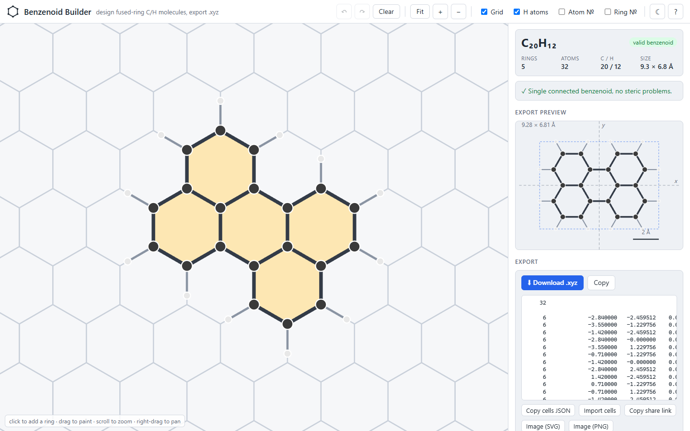
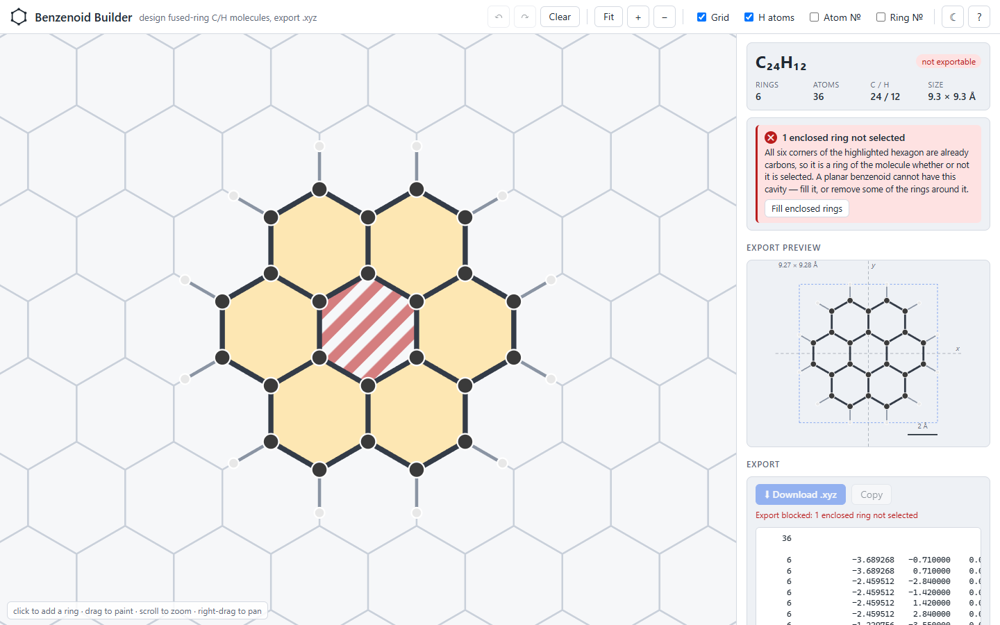

# Benzenoid Builder

An interactive honeycomb editor for designing **benzenoid molecules** — fused hexagonal
rings of carbon with hydrogens on the perimeter (benzene, naphthalene, pyrene, coronene,
graphene flakes, …) — and exporting them as standard **`.xyz`** files with ideal
lattice geometry.

Click hexagons on a honeycomb grid; the carbon skeleton and the hydrogens appear as you
go, the formula and validation update live, and the exported file is ready for
ParaView, Avogadro, VMD, or a quantum-chemistry / machine-learning pipeline.



It was written for the [current-density](https://github.com/imilos/current-density)
project, which predicts magnetically induced current density in such molecules with a
neural network, and it reproduces that project's Python generator exactly. It is
useful on its own for anyone who needs polycyclic aromatic hydrocarbon geometries quickly.

## Features

- **Draw on a honeycomb.** Click to add or remove a ring, drag to paint, scroll to zoom,
  right-drag to pan. Every hexagon corner is a carbon; perimeter carbons get a hydrogen
  automatically.
- **Live structure.** Ball-and-stick overlay on the grid, formula (C₂₄H₁₂), ring / atom
  counts, dimensions in Å, and a preview of the molecule exactly as it will be written.
- **Chemistry-aware validation** with one-click fixes:
  - the rings must form one edge-connected molecule (corner contact is not a bond);
  - an empty hexagon whose six corners are already carbons is a ring whether you
    selected it or not (six rings around a hole are coronene) — _Fill_ adds it;
  - overlapping hydrogens in fjord regions ([4]helicene and the like), where a planar
    model is physically wrong.
  There is no size limit: draw graphene flakes as large as you like.
- **Presets and families.** Benzene to hexabenzocoronene and the large flakes of the
  training set; parametric acenes, zigzag chains, hexagonal and rectangular flakes.
- **Export.** `.xyz` download or copy, ring coordinates as JSON, SVG / PNG image of the
  structure, and a share link that reproduces the whole state.
- **Parameters.** C–C and C–H bond lengths, orientation convention, file name, comment
  line, atomic numbers or element symbols.
- Undo / redo, keyboard shortcuts, light and dark themes. No server, no account: it is a
  static page.



## Running it

The app is a static site. To run it locally:

```bash
npm install
npm run dev        # http://localhost:5173
```

`npm run build` writes a deployable copy to `dist/`. The repository ships a GitHub
Actions workflow that publishes `dist/` to GitHub Pages on every push to `main`
(enable _Settings → Pages → Source: GitHub Actions_ once).

## How the geometry is built

Benzenoids are [polyhexes](<https://en.wikipedia.org/wiki/Polyhex_(mathematics)>): sets of
hexagons on a triangular lattice. The builder works in **integer lattice coordinates**
and converts to Ångström once at the end, so there are no floating-point tolerances
and no geometry optimisation.

A ring is an axial cell `(q, r)` with centre `(√3·d·(q + r/2), 1.5·d·r)` and pointy-top
orientation. Its six carbons sit on integer honeycomb sites

```
X = 2q + r + a_k,   Y = 3r + b_k,   (a_k, b_k) = (0,2) (−1,1) (−1,−1) (0,−2) (1,−1) (1,1)
```

at Cartesian position `(√3·d·X/2, d·Y/2)`. A carbon with only two carbon neighbours
carries one hydrogen along its third, missing, lattice direction — the exterior angle
bisector, without any trigonometry.

| Convention  | Value                                                                                                                                                                                                                      |
| ----------- | -------------------------------------------------------------------------------------------------------------------------------------------------------------------------------------------------------------------------- |
| d(C–C)      | **1.42 Å** (adjustable) — fitted to the DFT geometries of the current-density dataset; every atom of every benzenoid in that dataset lands within 0.17 Å of the ideal lattice, RMSD ≤ 0.075 Å                              |
| d(C–H)      | **1.09 Å** (adjustable)                                                                                                                                                                                                    |
| Frame       | all-atom centroid at the origin, molecule in the **z = 0** plane                                                                                                                                                           |
| Orientation | _long axis along x_ (default): principal axes of the carbon skeleton, heavier end (third moment) towards +x; round molecules (benzene, coronene, triphenylene, HBC) keep the lattice orientation. _As drawn_: only centred |
| Atom order  | carbons first, sorted by lattice site (X, then Y); then hydrogens in the order of their parent carbons                                                                                                                     |

### The `.xyz` file

```
    12

     6             -1.229756    0.710000    0.000000
     6             -1.229756   -0.710000    0.000000
     ...
     1             -2.173735    1.255000    0.000000
```

Line 1 is the atom count, line 2 the comment (blank by default), then one atom per line
as **atomic number** and x, y, z in Å with the fixed column widths of the dataset
(`%6d%22.6f%12.6f%12.6f`). Readers split on whitespace, so the widths are cosmetic.
Atomic numbers are what the current-density pipeline expects; viewers that only accept
element symbols (`C`, `H`) are served by the _Write element symbols_ switch under
Parameters.

### Interoperability with `current-density`

The ring coordinates the builder uses are the same axial cells that the
`molgen` service of the current-density project accepts. _Copy cells JSON_ gives you

```json
{"cells": [[0,0],[1,0],[1,1]]}
```

which can be sent to `POST /generate` as `{"spec": {"cells": [...]}}`; _Import cells_
accepts the same text (or a bare `[[q,r],…]` list, or `q,r q,r …`). The TypeScript core
is a port of `molgen/lattice.py`, and `tests/fixtures/` holds files generated by the
Python code that the port must reproduce byte for byte.

## Keyboard shortcuts

| Keys                                            | Action                                             |
| ----------------------------------------------- | -------------------------------------------------- |
| `Ctrl`+`Z` / `Ctrl`+`Shift`+`Z` (or `Ctrl`+`Y`) | undo / redo                                        |
| `Ctrl`+`S`                                      | download the `.xyz` file                           |
| `F` / `0`                                       | fit the view to the molecule / reset the view      |
| `G` `H` `L` `R`                                 | toggle grid, hydrogens, atom numbers, ring numbers |
| `Space` + drag                                  | pan                                                |
| `Shift` + drag                                  | erase rings                                        |
| `?`                                             | help                                               |

## Project layout

```
src/core/     chemistry engine, no DOM: lattice geometry, orientation, validation,
              presets and families, .xyz writer, share-link codec
src/ui/       React application: honeycomb canvas, sidebar panels, export preview
tests/        Vitest suites; tests/fixtures/*.xyz are generated by the Python molgen
scripts/      gen-fixtures.py (regenerate fixtures), screenshots.mjs (README images)
```

`src/core` is usable outside the app:

```ts
import { buildMolecule, hexFlake, toXyz, validateCells } from './src/core';

const cells = hexFlake(1); // coronene
console.log(validateCells(cells).ok); // true
console.log(toXyz(buildMolecule(cells))); // the .xyz text
```

## Development

```bash
npm run dev          # Vite dev server with hot reload
npm test             # Vitest (core + UI smoke tests)
npm run typecheck    # tsc
npm run lint         # ESLint
npm run format       # Prettier
npm run build        # production build in dist/
```

Regenerating the cross-check fixtures needs the current-density repository:

```bash
MOLGEN_SRC=/path/to/current-density/src python scripts/gen-fixtures.py
```

## Extending to other atoms

The core already carries an element registry (`src/core/elements.ts`: H, C, N, O, F, S,
Cl, B with atomic numbers, colours and typical bond lengths to carbon) and a per-site
terminal-atom map in `BuildParams.terminal`, so a perimeter hydrogen can be replaced by
another single atom without touching the writer or the renderer. The UI does not expose
this yet, because the current-density model has no channel for other elements; wiring a
picker to `terminal` is the intended path.

## Roadmap

- `.xyz` import with ring detection (port of `molgen/audit.py`)
- substituent picker for perimeter sites (see above)
- multi-atom substituents (OH, CH₃) with their own geometry
- non-planar structures (helicenes) are out of scope by design

## Citing

If this tool is useful in your work, please cite it — see [`CITATION.cff`](CITATION.cff).

## License

[MIT](LICENSE).
